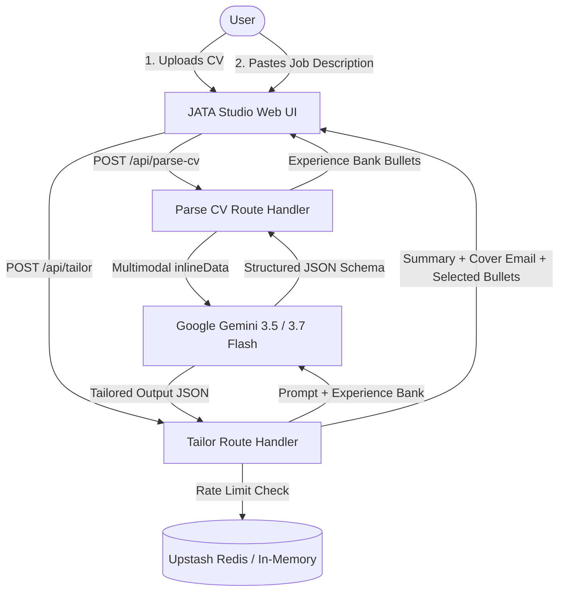

# JATA — Job Application Tailoring Assistant

<div align="center">
  <h3>⚡ AI-Powered CV Parsing, Experience Bank Extraction & Real-Time Job Application Tailoring</h3>
  <p>Transform your comprehensive CV into targeted job summaries, matching qualification highlights, and tailored cover emails in seconds.</p>

  <p>
    
    
    
    
    
    
  </p>
</div>

---

## 🌟 Overview

**JATA (Job Application Tailoring Assistant)** is a modern, full-stack AI application designed to streamline the job hunt. Instead of manually editing your resume for every single job posting, JATA:

1. **Ingests your CV** across multiple formats (PDF with native multimodal OCR, DOCX, or TXT).
2. **Builds an Experience Bank** of structured, quantified achievement bullets across cloud engineering, software, analytics, product, leadership, and public speaking.
3. **Analyzes target job requirements** in real-time.
4. **Synthesizes tailored application materials**:
   - 🎯 **Executive CV Profile Summary** (3–4 sentence hook aligned to the role).
   - ✉️ **High-Impact Cover Email** (<150 words, concise, ready to send).
   - 🔍 **Prioritized Experience Bullets** (ranked match highlights from your CV bank).

---

## ✨ Key Features

- **⚡ Native Multimodal PDF Parsing**: Powered directly by Gemini's multimodal vision engine to handle multi-column layouts, tables, and scanned text with zero native C++/canvas dependencies.
- **📂 Universal Format Support**: Supports PDF, DOCX (via pure JavaScript XML extraction), and plain text exports up to 5 MB.
- **🗂️ Interactive Experience Bank**:
  - Live keyword search across roles, technologies, and achievements.
  - Category filter pills (`cloud-infrastructure`, `software-mobile`, `data-analytics`, `product-operations`, `leadership-management`, `speaking-achievements`).
  - Metric extraction badges (e.g. `86 Lambdas`, `4.8/5 rating`, `41% escalation drop`).
  - Strength classification (`high`, `medium`, `low`) for impact prioritization.
- **🎨 Modern 2-Column AI Studio UI**: Sleek dark-mode glassmorphism interface with instant sample job insertion, progress spinners, tabbed output previews, and 1-click clipboard copying.
- **🛡️ Built-in Rate Limiting & Cost Protection**:
  - Per-IP rate limiting (10 generations/hour per visitor).
  - Cooldown anti-spam throttling (10-second interval).
  - Daily global budget cap to keep Gemini API usage bounded.
  - Upstash Redis support with graceful in-memory fallback on Vercel.

---

## 🏗️ System Architecture



---

## 🚀 Tech Stack

- **Framework**: [Next.js 16 (App Router)](https://nextjs.org/)
- **UI & Components**: [React 19](https://react.dev/), [Tailwind CSS v4](https://tailwindcss.com/)
- **AI Engine**: [Google GenAI SDK (`@google/genai`)](https://www.npmjs.com/package/@google/genai)
- **Document Extractors**: Native Gemini Multimodal Vision (PDF), [Mammoth](https://www.npmjs.com/package/mammoth) (DOCX)
- **Rate Limiting**: [Upstash Redis](https://upstash.com/) REST API / In-memory fallback
- **Deployment**: [Vercel](https://vercel.com/)

---

## 🛠️ Getting Started Locally

### 1. Clone the Repository
```bash
git clone https://github.com/WilliamKesuma/JATA.git
cd JATA
```

### 2. Install Dependencies
```bash
npm install
```

### 3. Configure Environment Variables
Create a `.env.local` file in the root directory:

```env
# Google Gemini API Key (Get one from https://aistudio.google.com/)
GEMINI_API_KEY=your_gemini_api_key_here

# (Optional) Upstash Redis for Production Rate Limiting
UPSTASH_REDIS_REST_URL=your_upstash_redis_rest_url
UPSTASH_REDIS_REST_TOKEN=your_upstash_redis_rest_token
```

### 4. Run Development Server
```bash
npm run dev
```

Open [http://localhost:3000](http://localhost:3000) with your browser to explore JATA!

---

## 📦 Deploying to Vercel

1. Push your code to your GitHub repository.
2. Import the repository on [Vercel](https://vercel.com/new).
3. Under **Project Settings → Environment Variables**, add:
   - `GEMINI_API_KEY`: *(Your Google AI Studio API Key)*
   - *(Optional)* `UPSTASH_REDIS_REST_URL` & `UPSTASH_REDIS_REST_TOKEN`
4. Click **Deploy**. Vercel will automatically build and deploy the app!

---

## 🔒 Security & Privacy

- **API Keys**: All API keys are stored server-side and never exposed to the client bundle.
- **Client Storage**: Extracted experience bullets are persisted in your browser's local storage (`localStorage`) for fast session resumption without storing personal data on a central database.
- **No Third-Party Native Binaries**: Uses native multimodal streaming to eliminate server-side vulnerabilities and runtime crashes.

---

## 👤 Author

**William Sanjaya Kesuma**
- LinkedIn: [William Sanjaya Kesuma](https://www.linkedin.com/in/williamskesuma/)
- GitHub: [@WilliamKesuma](https://github.com/WilliamKesuma)
